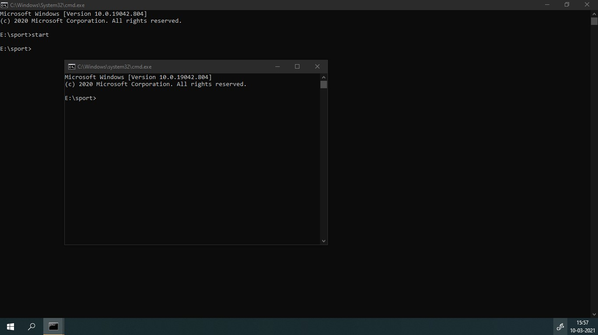
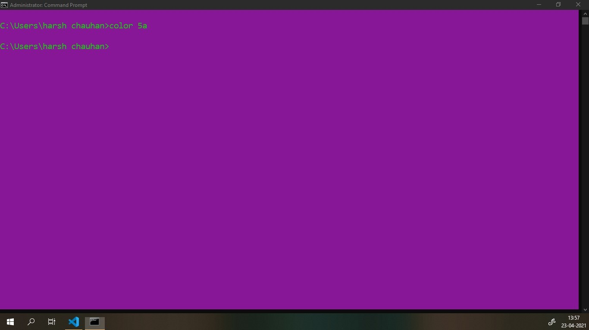

# cmd prompt


New additional linstance of cmd prompt(in current dir), 
---
type anyone of following cmd

```cmd
start  
start cmd
start cmd.exe
```


⮊Basics 
---
```
whoami # returns <laptop_name>\<username> laptop-8im0hadq\harsh chauhan  ✔️
ver    #  view windows version

cls    #  to clear cmd screen 
exit   #  exit the command prompt

time   # tells time
```

```
title Title_of_current_cmd_line_session
title %USERNAME%
```

graphics 
===
    0 = Black       8 = Gray
    1 = Blue        9 = Light Blue
    2 = Green       A = Light Green
    3 = Aqua        B = Light Aqua
    4 = Red         C = Light Red
    5 = Purple      D = Light Purple
    6 = Yellow      E = Light Yellow
    7 = White       F = Bright White

```
color <bkGroundColor><foregroundColor>

color 5a
```



Some variables 
===
```
echo %USERNAME%
echo %SystemRoot%
echo %SYSTEMROOT%
echo %NUMBER_OF_PROCESSORS%
echo %OS%
```

⮊ Directory Change 
===
e.g. `C:\Users\harsh chauhan>`
```
tree            : list(recursively) all subfolder in current dir, ✔️

cd        :   prints dir we r currently in

\book.pdf           :  the book.pdf file in current directory  ⭐
cd .. 				: 	to come one dir bkward
cd "D:\wd\notes" 	:	 
cd/					:	to come back to current drive 
../img/baby.jpg		:	to come one dir backward ,, then open img folder , and select baby.jpg file 
```
`In windows we use backslash to traverse to folder e.g  E:\nit\sem4 `

```
rmdir folderName	: 	to remove the "folder" -> folderName in the current dir 

rd /s myproject		:	force fully delete all folder in "myproject" folder in current dir 
rmdir /s myproject		:	force fully delete all folder in "myproject" folder in current dir 


rename oldName.pdf newName.pdf 		  :       to rename a file
ren oldName.pdf newName.pdf          :       to rename a file 
move hi.txt D:\webd\git     		:       move file hit.txt from current directory to another directory(i.e. D:\webd\git)     
```

⮊ File related
---

    type py.txt    - to  view content of text file in the cmd prompt 
    type code.cpp  - to  view content of .cpp file in the cmd prompt 

	 
⭐TIP
--- 
If you know how to run the command-line version, you can probably also figure out how to run the GUI version, while the opposite is not necessarily true


SYSTEM SPECIFIC 
===
```
systeminfo                // to see info of our sys.
```


LAN 
===
```
ipconfig /all             // to see MAC address of our sys.


net send 192.168.1.105 "hello"


msg * /server:192.168.1.105 /time:5  "hello"          --- availlabile only o win10 pro
 
msg /server:192.168.1.108 /time:5  "hello"  

msg /server:192.168.1.108 /time:5  * "hello"  

```