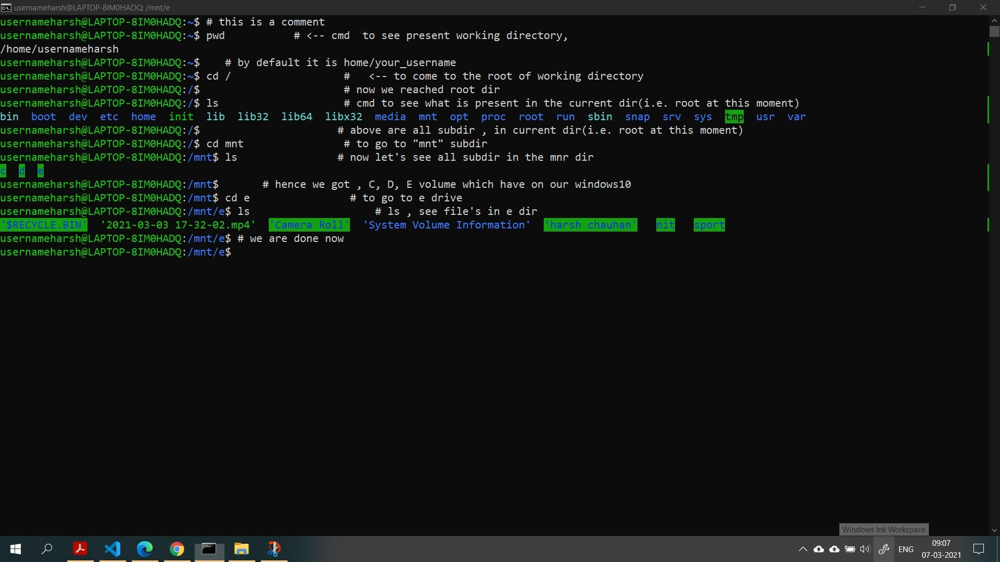

__CONTENTS__
===

- [#how-to-open-ubuntu-terminal-](#how-to-open-ubuntu-terminal-)
- [#c-in-linux](#c-in-linux)

[install ubuntu in wsl](https://wiki.ubuntu.com/WSL?&_ga=2.232980126.1893481185.1618394455-755482584.1618394455#Running_Graphical_Applications)

Ubuntu 20.04 LTS (Focal) is the current LTS release, supporting both x64 and ARM64 architecture


# How to open ubuntu terminal ?

+ either search in search bar 
+ or type anyone of following  cmd in cmd prompt
```bash
wsl        # good way , opens bash in he current directory
wsl.exe
ubuntu     # open's bash in ~ i.e. /home/USERNAME directory
```
+ *or go to directory where u want to open ubuntu >> then type **`wsl`** in search bar of that dir >> click enter* **EFFICIENT WAY**


config settings of ubuntu(in cmd prompt)
===
```bash
ubuntu /

wsl --list --all       # view distribution of linux install in ur windows
wsl -l -v 
```


close terminal 
---
```bash
logout
```


See windows c, d, e drive in UBUNTU(installed in wsl)   ✔️
===
1st open ubuntu terminal using [this](#how-to-open-ubuntu-terminal-)



⭐ case sensitivity : bash cmds are supported in ***lowerCase*** usually


LINUX CONFIGURATIONS
```bash
lsb_release -a   # shows the ubuntu version installed
ps -el           # to see currently active process
ps               #

whoami          # tells USERNAME

uname -a         # tells architecture 32 bit or 64 bit

echo $USER
echo $HOME
echo $PATH
each $OLDPWD    # prints the old dir we were workning on before navigating to present dir
```

comment in ubuntu
---
```bash
# single line comments are preceeded by hashtag sign

some cmd    # a inline cmntt side by side to describe this cmd
```

Statements
```bash
printf "hello world";
printf "hello world\n";
echo "hello world\n" 


rev             # reverses the string arg given to it
```

# Directory
***directory seprator*** is fwd slash **'`/`'**  

Colors  
- <span style="color:blue">blue</span> : directory


```bash


# ~~~~~~~~~~~~~~~~~~~~~~~
# rmdir : deletes only empty dir
rmdir dirName   # to  permanently  delete empty directory 
rmdir -p d1/d2/d3 # removes d3, the d2, then d1

# ~~~~~~~~~~~~~~~~~~~~~~~
rm -i fileName      # to remove a file
rm -i *.cpp         # to remove all .cpp file

# switch -i make it interactive, asks YES/NO for each file 
# press Ctrl-C to stop the operation entirely.


rm -rf dirName   # to permanently delete a non-empty directory, 💀 danger cmd, used only if u really want to delete that dir & no longer use in future. 
rm -r dirName   # r, means really, & recursively deletes all files/folders in the specified dir, 💀 danger cmd
```

```bash
# ~~~~~~~~~~~~~~~~~~~~~~~~~
ls 
ls -a           # shows hidden/dir files as well, switch -a means <all>
ls /mnt
ls /mnt/   # shows all drive in system
ls /SUB_DIR_NAME/SUB_SUB_DIR_NAME  # shows all file/folder in the specified subdir within a subdir
```

```bash
clear   # to clear console screen

pwd   # print working directory

cd         # change directory
cd /       # go to root dir
cd ~       # go to /home/USERNAME/ directory
cd ..      # come one dir backward 
cd ../..   # come two dir backward 
cd ../../FOLDER   # come two dir backward & then navigate to specified folder

cd -        # to switch to other working directory, on which we were earlier working

```

a good rule of thumb is to keep your file names all lower case, with only letters, numbers, '_' & '-'
```bash
touch fileName.ext         # to create a file in current working dir 
touch .fileName.ext         # to create a hidden file in current working dir 

mkdir newFolderName        # to make a new folder in the current dir
mkdir .newFolderName        # to make a new hidden folder in the current dir

mkdir                       # make directory

mkdir "folder name"       # if folder name consist of spaces

mkdir d1 d2 d3             # makes dir d1, d2, d3 in the currecnt dir}
# multiple arguments to mkdir to make multiple dir)

mkdir a/b/c                # makes dir  { [ (c inside b) inside a] inside current dir }, error comes if a & a/b dir  doesn't already exist
# hence use -p switch 
mkdir -p a/b/c             # makes dir  { [ (c inside b) inside a] inside current dir } 
# p : an option or switch which means "create a parent dir too"
```
```bash
/ # often refers to as root directory
```
```bash
~ # is /home/USERNAME
```

File modify
===
See file contents 
---
```bash
# cat - concatenate

# ~~~~~~~~~~~~~~~~~
# see the content of a file

cat op.txt                 # to see content of a file
cat f1.txt f2.txt f3.txt   # to see content of multiple files linked together in sequence

# ~~~~~~~~~~~~~~~~~~~~~~~
# wildcard characters 


# * for 0 or more char
# ? for any single char

cat *.txt
cat o*            # print content of all files with filename starting from o
cat *             # print content of all files
```

Write into file 
---
```bash
# ~~~~~~~~~~~~~~~~~~~~~~~~~~~~~
# Write into file

echo "heya bor" > op.txt   # empty the op.txt & then write "heya bor" to txt file

echo "heya bor" >> op.txt   # append something to txt file


cat file.txt > op.txt
#  ``shell clears out all the content of the file before it writes the output of your cat command into it``

cat file.txt >> op.txt
# to ``append`` content of file.txt to op.txt


less things.txt         # to see content of file conveniently in "less" shell, use q to quit "less" & come back to cmd line, End(on key 1 at keyboard) to see End of file

wc -l <file>              # line count in the file
```

pipe char `|`, to provide output of one cmd as input to another cmd
```
sort b.txt | less
sort b.txt | uniq | less
ls / | less
ls d1/d2 | less
```


```bash
# extract a *.gz file
gunzip myfile.tar.gz   # will unzip it to myfile.tar
tar -xvf myfile.tar    # will untar it
```

File movement 
---
```bash
mv op.txt d1/d2 # move the op.txt to [ (d2 dir in d1 dir) in current dir ]

mv d1/* .   # move all file/folder in dir d1 to curent dir(denoted by .)

# ~~~~~~~~~~~~~~``
# mv can take multiple arg as well

mv <pathToFile/FOLDER> <pathToFile/FOLDER> <pathToFile/FOLDER> <pathTOdestinationDIR>


# ~~~~~~~~~~~~~~~~~~~~~~~~~
# rename using mv

mv oldName.txt newName.txt
mv oldDirName  newDirName # rename a subdir

# ~~~~~~~~~~~~~~~~~~~~~
# copy

cp <pathOfFile> <pathWhereWeNeedToCopyFile>

cp file.txt BackupFile.txt
```

# c in linux
```bash
# first install g++ in linux using following cmd
sudo apt install g++    # to install g++

gcc -o code.exe code.c    # to compile code.c file 
./code.exe                # to run executable file(code.exe) of the code.cpp 

g++ -o code.exe code.cpp  # to compile code.cpp file 
./code.exe                # to run executable file(code.exe) of the code.cpp 


```


SUDO
===
If you’re using Ubuntu the **root account is disabled by default**

On a Ubuntu system the first user created when the system is installed is considered to be the superuser

```bash
sudo # Switch User & DO

sudo apt update         # to update

# ~~~~~~~~~~~~~~~~~~~~
sudo apt install g++    # to install g++
sudo apt install tree   # now we can see our dir structure using "tree" cmd in our current dir
tree                     # shows all dir/subdir/file recursively
tree -a                  # displays hidden files/dir as well

# ~~~~~~~~~~~~~~~~~~~~

sudo apt list --installed          # to see the package installed so far
sudo apt remove package_name        # to remove a package
```

file EDITORS FOR LINUX OS
===
- gedit


XMING 
===
 Xming allows the Windows machines **to display a graphical linux program** which is basically running on a remote Linux server(or WSL)